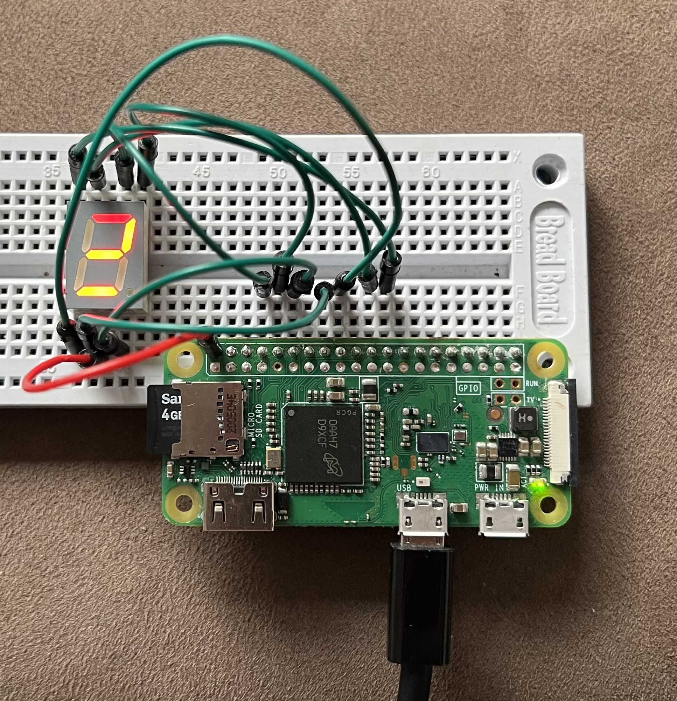

# pi_segment

This is a small program that uses either wiringpi or the bcm2835 library to interact with Raspberry Pi GPIOs, to write out a number onto a common cathode 7-segment display.

## Installation of build tools
```
sudo apt update
sudo apt install cmake clang llvm ninja-build git-core -y
```

## Installation of bcm2835

```
cd ~                  
wget http://www.airspayce.com/mikem/bcm2835/bcm2835-1.58.tar.gz                       
tar xvfz bcm2835-1.58.tar.gz;                      
cd bcm2835-1.58;                       
./configure;                      
make;        
sudo make install
```

## Installation of wiringpi

```
cd ~
git clone https://github.com/WiringPi/WiringPi
./build
gpio -v
gpio readall
```

## Compilation and running this program

```
cmake .
cmake --build .
./pi_segment
```

## Pinout on raspberry pi

| Raspberry Pi pin | 7-segment LED | WiringPi pin | GPIO/BCM2835 pin |
|------------------|---------------|--------------|------------------|
| 8                | a             | 15           | 14               |
| 10               | b             | 16           | 15               |
| 12               | c             | 1            | 18               |
| 16               | d             | 4            | 23               |
| 18               | e             | 5            | 24               |
| 22               | f             | 6            | 25               |
| 24               | g             | 10           | 8                |

## Picture of the setup for testing

This is my setup for testing this code, the C segment was broken.

